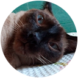

### *Crafting Digital Experiences with Elegance*

[](https://github.com/siamesecode)
[](https://github.com/siamesecode?tab=followers)
[](https://github.com/siamesecode?tab=repositories)

---


### 👋 Welcome to Siamese Code Repository!

*Where code meets creativity, and every line tells a story.*

</div>

---

## 🚀 About Us

We are a startup focused on creating amazing digital experiences. We combine modern design, high-performance development, and technological innovation to turn ideas into reality.

```javascript
const siameseCode = {
  mission: "Transform ideas into elegant digital solutions",
  values: ["Innovation", "Quality", "Creativity", "Performance"],
  focus: ["Web Development", "UI/UX Design", "3D Experiences"],
  stack: ["React", "Three.js", "Node.js", "Tailwind CSS"]
};
```

---

### 📈 Contribution Graph

[](https://github.com/siamesecode)

---

## 💻 Tech Stack

<div align="center">

### Frontend


### Backend & Tools


### Design & 3D


</div>

---

## 🎯 What We Do

```typescript
interface OurServices {
  webDevelopment: {
    responsive: boolean;
    modern: boolean;
    performant: boolean;
  };
  uiUxDesign: {
    userCentric: boolean;
    innovative: boolean;
    accessible: boolean;
  };
  threeDExperiences: {
    interactive: boolean;
    immersive: boolean;
    optimized: boolean;
  };
}
```

| | |
|:---:|:---|
| 🌐 | **Web Development** – Responsive and high-performance websites and web applications |
| 🎨 | **UI/UX Design** – Elegant and intuitive user interfaces |
| 🎮 | **3D Experiences** – Interactive experiences built with Three.js |
| ⚡ | **Performance Optimization** – Optimized code and lightning-fast loading |
| 📱 | **Responsive Design** – Perfect on any device |

</div>
---

## 🐾 Meet Our Mascot

<div align="center">

### 😺 Bugado Co-Founder and CEO

<!-- Adicione a foto do seu gato aqui -->


*"Every great cat has a devoted developer companion."*


</div>

---


**© 2025 Siamese Code. 

</div>


